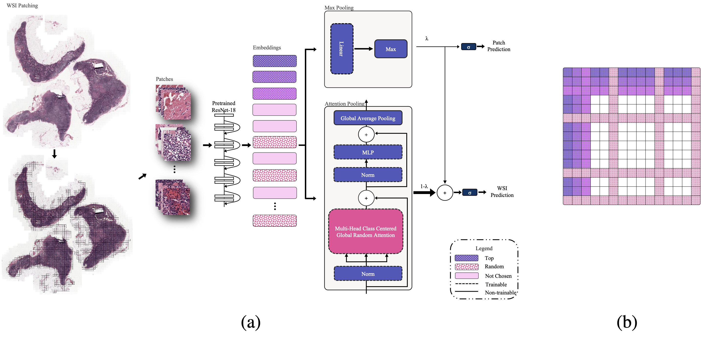
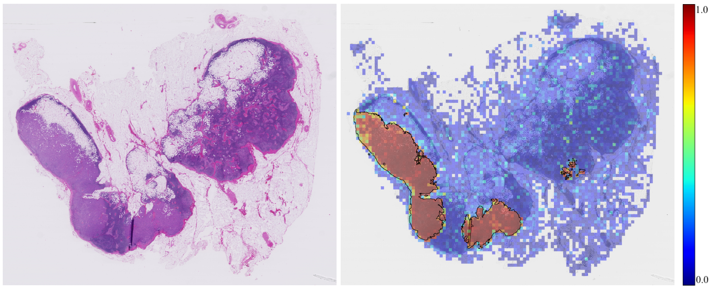

# MILFORMER: Weighted Dual Stream Random Class Centered Attention Multiple Instance Learning for Whole Slide Image Classification

## PyTorch Implementation and Experimentation

This repository contains the PyTorch implementation of MILFORMER.

### Architecture

### An example

